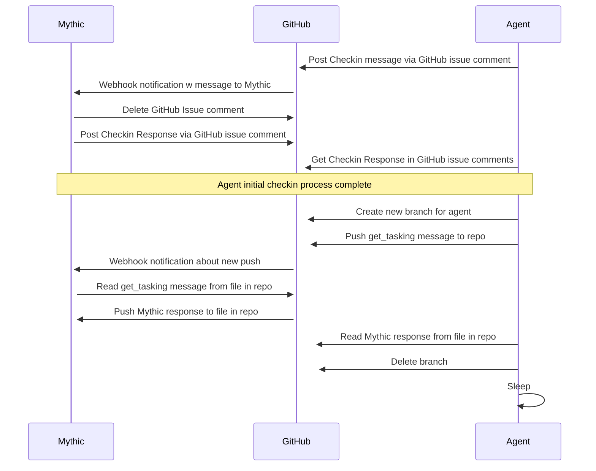
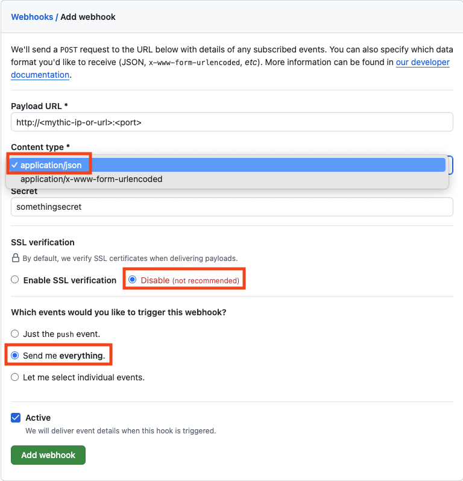
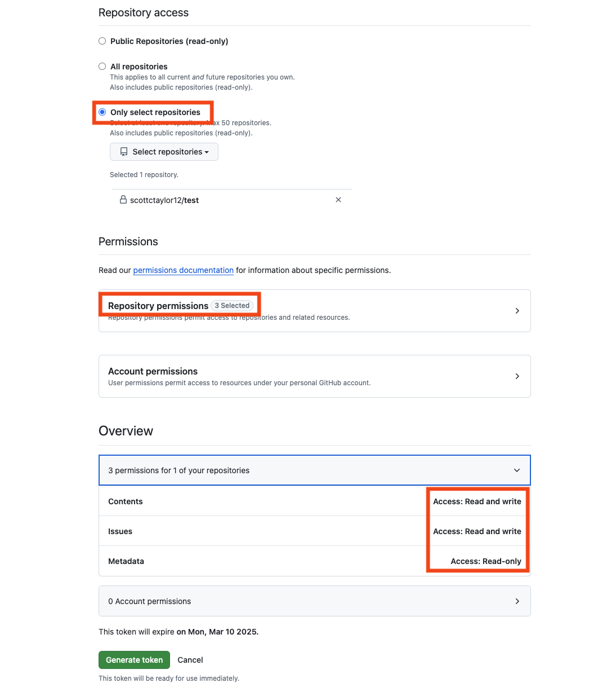

+++
title = "github"
chapter = false
weight = 5
+++

## Table of Contents
1. [Overview](#overview)
2. [Setup](#setup)
3. [Agent Build](#agent-build)
4. [OPSEC](#opsec)
5. [Development](#development)

## Overview
The GitHub C2 profile handles command and control communication by posting comments on GitHub issues and pushing files to repos. 
Setup and configuration is slightly tedious as the following are required:
* GitHub repo
* GitHub Issue #1 for messages from Mythic
* GitHub Issue #2 for messages from Agents
* GitHub repo Webhook for notifying Mythic of new GitHub events
* GitHub Personal Access Token to programmatically interact with GitHub

### GitHub C2 Workflow


## Setup

### 1. GitHub Repo
Go to github.com and create a new repository. 
For better OPSEC, make the repo private.

### 2. GitHub Issues
In the newly created github repository, create **2** new GitHub issues by browsing to `https://github.com/$USER/$REPO/issues`. 
The first GitHub issue (by default 1) will be for messages sent by Mythic while the second GitHub issue (by default 2) will be for messages sent by agents.

**KEEP TRACK THE GITHUB ISSUE NUMBERS!** 
This is required for configuration later on.

### 3. GitHub Webhook
How does Mythic know that a new comment is ready? A GitHub HTTP Webhook! 
With that said, the Mythic C2 Profile **must be internet accessible** somehow for GitHub to send the webhook notification directly to Mythic.

To create the webhook, go to your GitHub repo's webhook settings at `https://github.com/$USER/$REPO/settings/hooks` and select *Add webhook*. 
When adding the webhook, there are required settings that **must** be properly filled out:



#### Payload URL
As of now, the Mythic GitHub C2 Profile only supports **HTTP** traffic via the webhook. 
Therefore, start your URL with `http://`. 
You can make the Mythic GitHub C2 Profile port whatever you like (to be setup later). 
However, make sure that is accounted for in the payload URL! 
You can also use a redirector if you want to be fancy. An example URL might look like: `http://<mythic-server-ip>:1234`

#### Content Type
* *application/json*

#### Secret
* Enter any string. Remember it for later when configuring the Mythic GitHub C2 Profile later.

#### SSL verification
* *Disable (not recommended)*

#### Which events would you like to trigger this webhook?
* [x] *Send me **everything***

#### Active
* Check the box.

### 4. GitHub Personal Access Token
In order for Mythic and Agents to post comments onto GitHub programmatically, a Personal Access Token (PAT) is required. 
This can be done by browsing to `https://github.com/settings/tokens`. 
From there, select the *Generate new token* dropdown and choose *Generate new token (beta) Fine-grained, repo-scoped*. 
(The exact details may change if GitHub brings fine-grained tokens out of beta). 
The important details when generating the token are:



#### Expiration
* Consider the red team operation duration 
* Select an appropriate amount of time for the key to be active
* A custom date can be set if 90 days is too short.

#### Resource owner
* Select your username 
* Ensure the resource owner is the same owner of the GitHub repo that was created in step 1

#### Repository access
* *Only select repositories*  
* Select the repository created in step 1.

#### Repository Permissions
* *Contents -> Access: Read and Write*
* *Issues -> Access: Read and write* 
* *Metadata -> Access: Read* (should automatically get added)

**Copy the key after it is generated!** They key should start with *github_pat_*

### 5. Mythic Configuration
With the GitHub pieces in place, the Mythic GitHub C2 Profile is ready to be configured. 
If the C2 Profile has not been installed on the Mythic server yet, do so by logging into your Mythic server's command line and running `mythic-cli install github https://github.com/scottctaylor12/github`.  

Once installed:
* Log into the Mythic server web interface and select the headphone icon to browse to *C2 Profiles and Payload Types*
* To the right of the github c2 profile line, select the dropdown next to *Start Profile* and choose *View/Edit Config*
* From there, fill in all the details to match the settings from the previous setup steps.

Example Configuration
```
{
    "owner": "scottctaylor12",
    "repo": "prod",
    "server_issue": 1,
    "client_issue": 2,
    "github_token": "github_pat_xxxxxxxxx",
    "webhook_secret": "somethingsecret",
    "port": "1234"
}
```

After entering the configuration settings, Submit them and Start the C2 profile!

## Agent Build

### Profile Build Parameters

#### Callback interval in seconds
A number to indicate how many seconds the agent should wait in between tasking requests.

#### Callback Jitter
Percentage of jitter effect for callback interval.

#### Crypto Type
Indicate if you want to use no crypto (i.e. plaintext) or if you want to use Mythic's aes256_hmac. Using no crypto is really helpful for agent development so that it's easier to see messages and get started faster, but for actual operations you should leave the default to aes256_hmac.

#### GitHub issue # that agents will post results to	
GitHub Issue number that agents will post task results to. (Likely 2)

#### GitHub issue # that Mythic will post jobs to	
GitHub Issue number that Mythic will post new tasks to. (Likely 1)

#### GitHub Personal Access Token used to programatically access GitHub
The Personal Access Token that was created in Setup step 4.

#### GitHub repository to send communication through	
The name of the GitHub repo that was created in Setup step 1.

#### GitHub Username that owns the github_repo	
The user that owns the repository that was craeted in Setup step 1.

#### GitHub webhook secret used to validate incoming HTTP requests	
The secret that was entered when creating the GitHub webhook in Setup step 3.

#### Kill Date
Date for the agent to automatically exit, typically the after an assessment is finished.

#### Perform Key Exchange
T or F for if you want to perform a key exchange with the Mythic Server. When this is true, the agent uses the key specified by the base64 32Byte key to send an initial message to the Mythic server with a newly generated RSA public key. If this is set to `F`, then the agent tries to just use the base64 of the key as a static AES key for encryption. If that key is also blanked out, then the requests will all be in plaintext.

#### Proxy Password
If you need to authenticate to the proxy endpoint, specify the password here.

#### Proxy Host
If you need to manually specify a proxy endpoint, do that here. This follows the same format as the callback host.

#### Proxy Port
If you need to manually specify a proxy endpoint, this is where you specify the associated port number.

#### Proxy Username
If you need to authenticate to the proxy endpoint, specify the username here.

#### User Agent
The User Agent to be passed in the HTTP requests for calls to the REST API


## OPSEC
A few considerations:
* The web server included in this C2 Profile will be exposed to the internet to receive webhook notifications from GitHub. Take precautions like any HTTP C2 profile to avoid unwanted attention.
* Making the GitHub repo private is suggested to prevent others from peeking at the GitHub issues.
* To only allow connections from GitHub, the IP Address ranges are found under `"hooks"` at https://api.github.com/meta

## Development
All of the code for the server is written in Python and located in `C2_Profiles/github/github/c2_code`.

Please use the `dev` branch for any code contributions :)